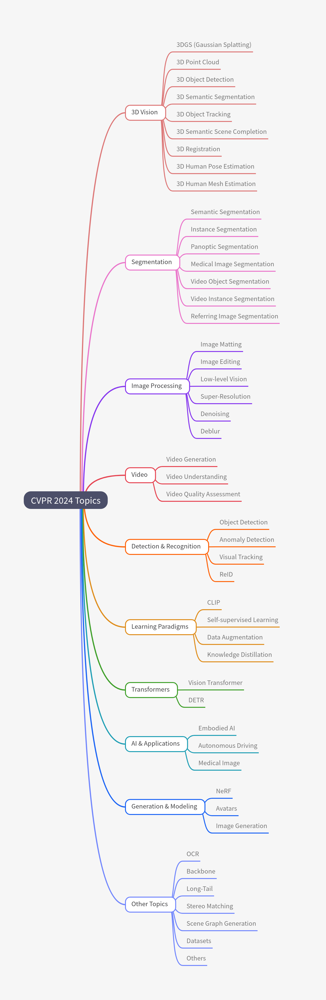

# CVPR 2024 

### Research Paper with Code

---
## Table of Contents
- [3DGS (Gaussian Splatting)](#3dgs-gaussian-splatting)
- [Avatars](#avatars)
- [Backbone](#backbone)
- [CLIP](#clip)
- [Embodied AI](#embodied-ai)
- [OCR](#ocr)
- [NeRF](#nerf)
- [DETR](#detr)
- [ReID](#reid)
- [Long-Tail](#long-tail)
- [Vision Transformer](#vision-transformer)
- [Vision-Language](#vision-language)
- [Self-supervised Learning](#self-supervised-learning)
- [Data Augmentation](#data-augmentation)
- [Object Detection](#object-detection)
- [Anomaly Detection](#anomaly-detection)
- [Visual Tracking](#visual-tracking)
- [Semantic Segmentation](#semantic-segmentation)
- [Instance Segmentation](#instance-segmentation)
- [Panoptic Segmentation](#panoptic-segmentation)
- [Medical Image](#medical-image)
- [Medical Image Segmentation](#medical-image-segmentation)
- [Video Object Segmentation](#video-object-segmentation)
- [Video Instance Segmentation](#video-instance-segmentation)
- [Referring Image Segmentation](#referring-image-segmentation)
- [Image Matting](#image-matting)
- [Image Editing](#image-editing)
- [Low-level Vision](#low-level-vision)
- [Super-Resolution](#super-resolution)
- [Denoising](#denoising)
- [Deblur](#deblur)
- [Autonomous Driving](#autonomous-driving)
- [3D Point Cloud](#3d-point-cloud)
- [3D Object Detection](#3d-object-detection)
- [3D Semantic Segmentation](#3d-semantic-segmentation)
- [3D Object Tracking](#3d-object-tracking)
- [3D Semantic Scene Completion](#3d-semantic-scene-completion)
- [3D Registration](#3d-registration)
- [3D Human Pose Estimation](#3d-human-pose-estimation)
- [3D Human Mesh Estimation](#3d-human-mesh-estimation)
- [Image Generation](#image-generation)
- [Video Generation](#video-generation)
- [Video Understanding](#video-understanding)
- [Knowledge Distillation](#knowledge-distillation)
- [Stereo Matching](#stereo-matching)
- [Scene Graph Generation](#scene-graph-generation)
- [Video Quality Assessment](#video-quality-assessment)
- [Datasets](#datasets)
- [Others](#others)

### Domain-wise Table

#### 3DGS (Gaussian Splatting)

| Index | Paper Title                                                  | Paper Link                                | Code                                                        | Official Repo                                                |
| ----- | ------------------------------------------------------------ | ----------------------------------------- | ----------------------------------------------------------- | ------------------------------------------------------------ |
| 1     | Scaffold-GS: Structured 3D Gaussians for View-Adaptive Rendering | [Paper](https://arxiv.org/abs/2312.00109) | [Code](https://github.com/city-super/Scaffold-GS)           | [Homepage](https://city-super.github.io/scaffold-gs/)        |
| 2     | GPS-Gaussian: Generalizable Pixel-wise 3D Gaussian Splatting for Real-time Human Novel View Synthesis | [Paper](https://arxiv.org/abs/2312.02155) | [Code](https://github.com/ShunyuanZheng/GPS-Gaussian)       | [Homepage](https://shunyuanzheng.github.io/GPS-Gaussian)     |
| 3     | GaussianAvatar: Towards Realistic Human Avatar Modeling from a Single Video via Animatable 3D Gaussians | [Paper](https://arxiv.org/abs/2312.02134) | [Code](https://github.com/huliangxiao/GaussianAvatar)       | N/A                                                          |
| 4     | GaussianEditor: Swift and Controllable 3D Editing with Gaussian Splatting | [Paper](https://arxiv.org/abs/2311.14521) | [Code](https://github.com/buaacyw/GaussianEditor)           | N/A                                                          |
| 5     | Deformable 3D Gaussians for High-Fidelity Monocular Dynamic Scene Reconstruction | [Paper](https://arxiv.org/abs/2309.13101) | [Code](https://github.com/ingra14m/Deformable-3D-Gaussians) | [Homepage](https://ingra14m.github.io/Deformable-Gaussians/) |

#### Avatars

| Index | Paper Title                                                  | Paper Link                                | Code                                                  | Official Repo                                 |
| ----- | ------------------------------------------------------------ | ----------------------------------------- | ----------------------------------------------------- | --------------------------------------------- |
| 6     | GaussianAvatar: Towards Realistic Human Avatar Modeling from a Single Video via Animatable 3D Gaussians | [Paper](https://arxiv.org/abs/2312.02134) | [Code](https://github.com/huliangxiao/GaussianAvatar) | N/A                                           |
| 7     | Real-Time Simulated Avatar from Head-Mounted Sensors         | [Paper](https://arxiv.org/abs/2403.06862) | N/A                                                   | [Homepage](https://www.zhengyiluo.com/SimXR/) |

#### Backbone

| Index | Paper Title                                                  | Paper Link                                | Code                                                | Official Repo |
| ----- | ------------------------------------------------------------ | ----------------------------------------- | --------------------------------------------------- | ------------- |
| 8     | RepViT: Revisiting Mobile CNN From ViT Perspective           | [Paper](https://arxiv.org/abs/2307.09283) | [Code](https://github.com/THU-MIG/RepViT)           | N/A           |
| 9     | TransNeXt: Robust Foveal Visual Perception for Vision Transformers | [Paper](https://arxiv.org/abs/2311.17132) | [Code](https://github.com/DaiShiResearch/TransNeXt) | N/A           |

#### CLIP

| Index | Paper Title                                               | Paper Link                                | Code                                                         | Official Repo |
| ----- | --------------------------------------------------------- | ----------------------------------------- | ------------------------------------------------------------ | ------------- |
| 10    | Alpha-CLIP: A CLIP Model Focusing on Wherever You Want    | [Paper](https://arxiv.org/abs/2312.03818) | [Code](https://github.com/SunzeY/AlphaCLIP)                  | N/A           |
| 11    | FairCLIP: Harnessing Fairness in Vision-Language Learning | [Paper](https://arxiv.org/abs/2403.19949) | [Code](https://github.com/Harvard-Ophthalmology-AI-Lab/FairCLIP) | N/A           |

#### Embodied AI

| Index | Paper Title                                                  | Paper Link                                | Code                                                 | Official Repo                                        |
| ----- | ------------------------------------------------------------ | ----------------------------------------- | ---------------------------------------------------- | ---------------------------------------------------- |
| 12    | EmbodiedScan: A Holistic Multi-Modal 3D Perception Suite Towards Embodied AI | [Paper](https://arxiv.org/abs/2312.16170) | [Code](https://github.com/OpenRobotLab/EmbodiedScan) | [Homepage](https://tai-wang.github.io/embodiedscan/) |
| 13    | MP5: A Multi-modal Open-ended Embodied System in Minecraft via Active Perception | [Paper](https://arxiv.org/abs/2312.07472) | [Code](https://github.com/IranQin/MP5)               | [Homepage](https://iranqin.github.io/MP5.github.io/) |

#### OCR

| Index | Paper Title                                                  | Paper Link                                | Code                                                         | Official Repo |
| ----- | ------------------------------------------------------------ | ----------------------------------------- | ------------------------------------------------------------ | ------------- |
| 14    | An Empirical Study of Scaling Law for OCR                    | [Paper](https://arxiv.org/abs/2401.00028) | [Code](https://github.com/large-ocr-model/large-ocr-model.github.io) | N/A           |
| 15    | ODM: A Text-Image Further Alignment Pre-training Approach for Scene Text Detection and Spotting | [Paper](https://arxiv.org/abs/2403.00303) | [Code](https://github.com/PriNing/ODM)                       | N/A           |

#### NeRF

| Index | Paper Title                                                  | Paper Link                                | Code                                        | Official Repo |
| ----- | ------------------------------------------------------------ | ----------------------------------------- | ------------------------------------------- | ------------- |
| 16    | PIE-NeRF: Physics-based Interactive Elastodynamics with NeRF | [Paper](https://arxiv.org/abs/2311.13099) | [Code](https://github.com/FYTalon/pienerf/) | N/A           |

#### DETR

| Index | Paper Title                                                  | Paper Link                                | Code                                             | Official Repo |
| ----- | ------------------------------------------------------------ | ----------------------------------------- | ------------------------------------------------ | ------------- |
| 17    | DETRs Beat YOLOs on Real-time Object Detection               | [Paper](https://arxiv.org/abs/2304.08069) | [Code](https://github.com/lyuwenyu/RT-DETR)      | N/A           |
| 18    | Salience DETR: Enhancing Detection Transformer with Hierarchical Salience Filtering Refinement | [Paper](https://arxiv.org/abs/2403.16131) | [Code](https://github.com/xiuqhou/Salience-DETR) | N/A           |

#### ReID

| Index | Paper Title                                                  | Paper Link                                | Code                                        | Official Repo |
| ----- | ------------------------------------------------------------ | ----------------------------------------- | ------------------------------------------- | ------------- |
| 19    | Magic Tokens: Select Diverse Tokens for Multi-modal Object Re-Identification | [Paper](https://arxiv.org/abs/2403.10254) | [Code](https://github.com/924973292/EDITOR) | N/A           |
| 20    | Noisy-Correspondence Learning for Text-to-Image Person Re-identification | [Paper](https://arxiv.org/abs/2308.09911) | [Code](https://github.com/QinYang79/RDE)    | N/A           |

#### Long-Tail

| Index | Paper Title                                                  | Paper Link                                | Code                                                         | Official Repo |
| ----- | ------------------------------------------------------------ | ----------------------------------------- | ------------------------------------------------------------ | ------------- |
| 1     | Delving into the Trajectory Long-tail Distribution for Multi-object Tracking | [Paper](https://arxiv.org/abs/2403.04700) | [Code](https://github.com/chen-si-jia/Trajectory-Long-tail-Distribution-for-MOT) | N/A           |

#### Vision Transformer

| Index | Paper Title                                                  | Paper Link                                | Code                                                | Official Repo |
| ----- | ------------------------------------------------------------ | ----------------------------------------- | --------------------------------------------------- | ------------- |
| 2     | TransNeXt: Robust Foveal Visual Perception for Vision Transformers | [Paper](https://arxiv.org/abs/2311.17132) | [Code](https://github.com/DaiShiResearch/TransNeXt) | N/A           |
| 3     | RepViT: Revisiting Mobile CNN From ViT Perspective           | [Paper](https://arxiv.org/abs/2307.09283) | [Code](https://github.com/THU-MIG/RepViT)           | N/A           |

#### Vision-Language

| Index | Paper Title                                                  | Paper Link                                | Code                                                         | Official Repo |
| ----- | ------------------------------------------------------------ | ----------------------------------------- | ------------------------------------------------------------ | ------------- |
| 4     | PromptKD: Unsupervised Prompt Distillation for Vision-Language Models | [Paper](https://arxiv.org/abs/2403.02781) | [Code](https://github.com/zhengli97/PromptKD)                | N/A           |
| 5     | FairCLIP: Harnessing Fairness in Vision-Language Learning    | [Paper](https://arxiv.org/abs/2403.19949) | [Code](https://github.com/Harvard-Ophthalmology-AI-Lab/FairCLIP) | N/A           |

#### Self-supervised Learning

| Index | Paper Title | Paper Link | Code | Official Repo |
| ----- | ----------- | ---------- | ---- | ------------- |
| 6     | N/A         | N/A        | N/A  | N/A           |

#### Data Augmentation

| Index | Paper Title | Paper Link | Code | Official Repo |
| ----- | ----------- | ---------- | ---- | ------------- |
| 7     | DiffuseMix: Label-Preserving Data Augmentation with Diffusion Models         | [Paper](https://arxiv.org/pdf/2405.14881)        | [Code](https://github.com/khawar-islam/diffuseMix)  | N/A           |

#### Object Detection

| Index | Paper Title                                                  | Paper Link                                | Code                                                         | Official Repo |
| ----- | ------------------------------------------------------------ | ----------------------------------------- | ------------------------------------------------------------ | ------------- |
| 8     | DETRs Beat YOLOs on Real-time Object Detection               | [Paper](https://arxiv.org/abs/2304.08069) | [Code](https://github.com/lyuwenyu/RT-DETR)                  | N/A           |
| 9     | Boosting Object Detection with Zero-Shot Day-Night Domain Adaptation | [Paper](https://arxiv.org/abs/2312.01220) | [Code](https://github.com/ZPDu/Boosting-Object-Detection-with-Zero-Shot-Day-Night-Domain-Adaptation) | N/A           |
| 10    | YOLO-World: Real-Time Open-Vocabulary Object Detection       | [Paper](https://arxiv.org/abs/2401.17270) | [Code](https://github.com/AILab-CVC/YOLO-World)              | N/A           |
| 11    | Salience DETR: Enhancing Detection Transformer with Hierarchical Salience Filtering Refinement | [Paper](https://arxiv.org/abs/2403.16131) | [Code](https://github.com/xiuqhou/Salience-DETR)             | N/A           |

#### Anomaly Detection

| Index | Paper Title                                                  | Paper Link                                | Code                                    | Official Repo |
| ----- | ------------------------------------------------------------ | ----------------------------------------- | --------------------------------------- | ------------- |
| 12    | Anomaly Heterogeneity Learning for Open-set Supervised Anomaly Detection | [Paper](https://arxiv.org/abs/2310.12790) | [Code](https://github.com/mala-lab/AHL) | N/A           |

#### Visual Tracking

| Index | Paper Title | Paper Link | Code | Official Repo |
| ----- | ----------- | ---------- | ---- | ------------- |
| 13    | N/A         | N/A        | N/A  | N/A           |

#### Semantic Segmentation

| Index | Paper Title                                                  | Paper Link                                | Code                                   | Official Repo |
| ----- | ------------------------------------------------------------ | ----------------------------------------- | -------------------------------------- | ------------- |
| 14    | Stronger, Fewer, & Superior: Harnessing Vision Foundation Models for Domain Generalized Semantic Segmentation | [Paper](https://arxiv.org/abs/2312.04265) | [Code](https://github.com/w1oves/Rein) | N/A           |
| 15    | SED: A Simple Encoder-Decoder for Open-Vocabulary Semantic Segmentation | [Paper](https://arxiv.org/abs/2311.15537) | [Code](https://github.com/xb534/SED)   | N/A           |

#### Instance Segmentation

| Index | Paper Title | Paper Link | Code | Official Repo |
| ----- | ----------- | ---------- | ---- | ------------- |
| 16    | N/A         | N/A        | N/A  | N/A           |

#### Panoptic Segmentation

| Index | Paper Title | Paper Link | Code | Official Repo |
| ----- | ----------- | ---------- | ---- | ------------- |
| 17    | N/A         | N/A        | N/A  | N/A           |

#### Medical Image

| Index | Paper Title                                                  | Paper Link                                | Code                                          | Official Repo |
| ----- | ------------------------------------------------------------ | ----------------------------------------- | --------------------------------------------- | ------------- |
| 18    | Feature Re-Embedding: Towards Foundation Model-Level Performance in Computational Pathology | [Paper](https://arxiv.org/abs/2402.17228) | [Code](https://github.com/DearCaat/RRT-MIL)   | N/A           |
| 19    | VoCo: A Simple-yet-Effective Volume Contrastive Learning Framework for 3D Medical Image Analysis | [Paper](https://arxiv.org/abs/2402.17300) | [Code](https://github.com/Luffy03/VoCo)       | N/A           |
| 20    | ChAda-ViT : Channel Adaptive Attention for Joint Representation Learning of Heterogeneous Microscopy Images | [Paper](https://arxiv.org/abs/2311.15264) | [Code](https://github.com/nicoboou/chada_vit) | N/A           |

#### Medical Image Segmentation

| Index | Paper Title | Paper Link | Code | Official Repo |
| ----- | ----------- | ---------- | ---- | ------------- |
| 21    | N/A         | N/A        | N/A  | N/A           |

#### Video Object Segmentation

| Index | Paper Title | Paper Link | Code | Official Repo |
| ----- | ----------- | ---------- | ---- | ------------- |
| 22    | N/A         | N/A        | N/A  | N/A           |

#### Video Instance Segmentation

| Index | Paper Title | Paper Link | Code | Official Repo |
| ----- | ----------- | ---------- | ---- | ------------- |
| 23    | N/A         | N/A        | N/A  | N/A           |

#### Referring Image Segmentation

| Index | Paper Title | Paper Link | Code | Official Repo |
| ----- | ----------- | ---------- | ---- | ------------- |
| 24    | N/A         | N/A        | N/A  | N/A           |

#### Image Matting

| Index | Paper Title | Paper Link | Code | Official Repo |
| ----- | ----------- | ---------- | ---- | ------------- |
| 25    | N/A         | N/A        | N/A  | N/A           |

#### Image Editing

| Index | Paper Title                                       | Paper Link                                | Code                                                  | Official Repo                                            |
| ----- | ------------------------------------------------- | ----------------------------------------- | ----------------------------------------------------- | -------------------------------------------------------- |
| 26    | Edit One for All: Interactive Batch Image Editing | [Paper](https://arxiv.org/abs/2401.10219) | [Code](https://github.com/thaoshibe/edit-one-for-all) | [Homepage](https://thaoshibe.github.io/edit-one-for-all) |

#### Low-level Vision

| Index | Paper Title                                                  | Paper Link                                | Code                                     | Official Repo |
| ----- | ------------------------------------------------------------ | ----------------------------------------- | ---------------------------------------- | ------------- |
| 27    | Residual Denoising Diffusion Models                          | [Paper](https://arxiv.org/abs/2308.13712) | [Code](https://github.com/nachifur/RDDM) | N/A           |
| 28    | Boosting Image Restoration via Priors from Pre-trained Models | [Paper](https://arxiv.org/abs/2403.06793) | N/A                                      | N/A           |

#### Super-Resolution)

| Index | Paper Title                                                  | Paper Link                                | Code                                                 | Official Repo |
| ----- | ------------------------------------------------------------ | ----------------------------------------- | ---------------------------------------------------- | ------------- |
| 29    | SeD: Semantic-Aware Discriminator for Image Super-Resolution | [Paper](https://arxiv.org/abs/2402.19387) | [Code](https://github.com/lbc12345/SeD)              | N/A           |
| 30    | APISR: Anime Production Inspired Real-World Anime Super-Resolution | [Paper](https://arxiv.org/abs/2403.01598) | [Code](https://github.com/Kiter### Domain-wise Table |               |

#### Denoising

| Index | Paper Title                         | Paper Link                                | Code                                     | Official Repo |
| ----- | ----------------------------------- | ----------------------------------------- | ---------------------------------------- | ------------- |
| 31    | Residual Denoising Diffusion Models | [Paper](https://arxiv.org/abs/2308.13712) | [Code](https://github.com/nachifur/RDDM) | N/A           |

#### Deblur

| Index | Paper Title | Paper Link | Code | Official Repo |
| ----- | ----------- | ---------- | ---- | ------------- |
| 32    | N/A         | N/A        | N/A  | N/A           |

#### Autonomous Driving

| Index | Paper Title                                                  | Paper Link                                | Code                                            | Official Repo |
| ----- | ------------------------------------------------------------ | ----------------------------------------- | ----------------------------------------------- | ------------- |
| 33    | UniPAD: A Universal Pre-training Paradigm for Autonomous Driving | [Paper](https://arxiv.org/abs/2310.08370) | [Code](https://github.com/Nightmare-n/UniPAD)   | N/A           |
| 34    | Cam4DOcc: Benchmark for Camera-Only 4D Occupancy Forecasting in Autonomous Driving Applications | [Paper](https://arxiv.org/abs/2311.17663) | [Code](https://github.com/haomo-ai/Cam4DOcc)    | N/A           |
| 35    | Memory-based Adapters for Online 3D Scene Perception         | [Paper](https://arxiv.org/abs/2403.06974) | [Code](https://github.com/xuxw98/Online3D)      | N/A           |
| 36    | Symphonize 3D Semantic Scene Completion with Contextual Instance Queries | [Paper](https://arxiv.org/abs/2306.15670) | [Code](https://github.com/hustvl/Symphonies)    | N/A           |
| 37    | A Real-world Large-scale Dataset for Roadside Cooperative Perception | [Paper](https://arxiv.org/abs/2403.10145) | [Code](https://github.com/AIR-THU/DAIR-RCooper) | N/A           |
| 38    | Adaptive Fusion of Single-View and Multi-View Depth for Autonomous Driving | [Paper](https://arxiv.org/abs/2403.07535) | [Code](https://github.com/Junda24/AFNet)        | N/A           |

#### 3D Point Cloud

| Index | Paper Title | Paper Link | Code | Official Repo |
| ----- | ----------- | ---------- | ---- | ------------- |
| 40    | N/A         | N/A        | N/A  | N/A           |

#### 3D Object Detection

| Index | Paper Title                                                  | Paper Link                                | Code                                         | Official Repo |
| ----- | ------------------------------------------------------------ | ----------------------------------------- | -------------------------------------------- | ------------- |
| 41    | PTT: Point-Trajectory Transformer for Efficient Temporal 3D Object Detection | [Paper](https://arxiv.org/abs/2312.08371) | [Code](https://github.com/kuanchihhuang/PTT) | N/A           |
| 42    | UniMODE: Unified Monocular 3D Object Detection               | [Paper](https://arxiv.org/abs/2402.18573) | N/A                                          | N/A           |

#### 3D Semantic Segmentation

| Index | Paper Title | Paper Link | Code | Official Repo |
| ----- | ----------- | ---------- | ---- | ------------- |
| 43    | N/A         | N/A        | N/A  | N/A           |

#### 3D Object Tracking

| Index | Paper Title | Paper Link | Code | Official Repo |
| ----- | ----------- | ---------- | ---- | ------------- |
| 44    | N/A         | N/A        | N/A  | N/A           |

#### 3D Semantic Scene Completion

| Index | Paper Title                                                  | Paper Link                                | Code                                         | Official Repo |
| ----- | ------------------------------------------------------------ | ----------------------------------------- | -------------------------------------------- | ------------- |
| 45    | Symphonize 3D Semantic Scene Completion with Contextual Instance Queries | [Paper](https://arxiv.org/abs/2306.15670) | [Code](https://github.com/hustvl/Symphonies) | N/A           |

#### 3D Registration

| Index | Paper Title | Paper Link | Code | Official Repo |
| ----- | ----------- | ---------- | ---- | ------------- |
| 46    | N/A         | N/A        | N/A  | N/A           |

#### 3D Human Pose Estimation

| Index | Paper Title                                                  | Paper Link                                | Code                                          | Official Repo |
| ----- | ------------------------------------------------------------ | ----------------------------------------- | --------------------------------------------- | ------------- |
| 47    | Hourglass Tokenizer for Efficient Transformer-Based 3D Human Pose Estimation | [Paper](https://arxiv.org/abs/2311.12028) | [Code](https://github.com/NationalGAILab/HoT) | N/A           |

#### 3D Human Mesh Estimation

| Index | Paper Title | Paper Link | Code | Official Repo |
| ----- | ----------- | ---------- | ---- | ------------- |
| 48    | N/A         | N/A        | N/A  | N/A           |

#### Medical Image

| Index | Paper Title                                                  | Paper Link                                | Code                                          | Official Repo |
| ----- | ------------------------------------------------------------ | ----------------------------------------- | --------------------------------------------- | ------------- |
| 49    | Feature Re-Embedding: Towards Foundation Model-Level Performance in Computational Pathology | [Paper](https://arxiv.org/abs/2402.17228) | [Code](https://github.com/DearCaat/RRT-MIL)   | N/A           |
| 50    | VoCo: A Simple-yet-Effective Volume Contrastive Learning Framework for 3D Medical Image Analysis | [Paper](https://arxiv.org/abs/2402.17300) | [Code](https://github.com/Luffy03/VoCo)       | N/A           |
| 51    | ChAda-ViT : Channel Adaptive Attention for Joint Representation Learning of Heterogeneous Microscopy Images | [Paper](https://arxiv.org/abs/2311.15264) | [Code](https://github.com/nicoboou/chada_vit) | N/A           |

#### Image Generation

| Index | Paper Title                                                  | Paper Link                                | Code                                                     | Official Repo                                                |
| ----- | ------------------------------------------------------------ | ----------------------------------------- | -------------------------------------------------------- | ------------------------------------------------------------ |
| 52    | InstanceDiffusion: Instance-level Control for Image Generation | [Paper](https://arxiv.org/abs/2402.03290) | [Code](https://github.com/frank-xwang/InstanceDiffusion) | [Homepage](https://people.eecs.berkeley.edu/~xdwang/projects/InstDiff/) |
| 53    | ECLIPSE: A Resource-Efficient Text-to-Image Prior for Image Generations | [Paper](https://arxiv.org/abs/2312.04655) | [Code](https://github.com/eclipse-t2i/eclipse-inference) | [Homepage](https://eclipse-t2i.vercel.app/)                  |
| 54    | Instruct-Imagen: Image Generation with Multi-modal Instruction | [Paper](https://arxiv.org/abs/2401.01952) | N/A                                                      | N/A                                                          |
| 55    | UniGS: Unified Representation for Image Generation and Segmentation | [Paper](https://arxiv.org/abs/2312.01985) | N/A                                                      | N/A                                                          |
| 56    | Multi-Instance Generation Controller for Text-to-Image Synthesis | [Paper](https://arxiv.org/abs/2402.05408) | [Code](https://github.com/limuloo/migc)                  | N/A                                                          |
| 57    | SVGDreamer: Text Guided SVG Generation with Diffusion Model  | [Paper](https://arxiv.org/abs/2312.16476) | [Code](https://ximinng.github.io/SVGDreamer-project/)    | N/A                                                          |
| 58    | InteractDiffusion: Interaction-Control for Text-to-Image Diffusion Model | [Paper](https://arxiv.org/abs/2312.05849) | [Code](https://github.com/jiuntian/interactdiffusion)    | N/A                                                          |
| 59    | Ranni: Taming Text-to-Image Diffusion for Accurate Prompt Following | [Paper](https://arxiv.org/abs/2311.17002) | [Code](https://github.com/ali-vilab/Ranni)               | N/A                                                          |

#### Video Generation

| Index | Paper Title                                                  | Paper Link                                | Code                                                         | Official Repo                                                |
| ----- | ------------------------------------------------------------ | ----------------------------------------- | ------------------------------------------------------------ | ------------------------------------------------------------ |
| 60    | Vlogger: Make Your Dream A Vlog                              | [Paper](https://arxiv.org/abs/2401.09414) | [Code](https://github.com/Vchitect/Vlogger)                  | N/A                                                          |
| 61    | VBench: Comprehensive Benchmark Suite for Video Generative Models | [Paper](https://arxiv.org/abs/2311.17982) | [Code](https://github.com/Vchitect/VBench)                   | [Homepage](https://vchitect.github.io/VBench-project/)       |
| 62    | VMC: Video Motion Customization using Temporal Attention Adaption for Text-to-Video Diffusion Models | [Paper](https://arxiv.org/abs/2312.00845) | [Code](https://github.com/HyeonHo99/Video-Motion-Customization) | [Homepage](https://github.com/HyeonHo99/Video-Motion-Customization) |

#### Vision Transformer

| Index | Paper Title                                                  | Paper Link                                | Code                                                | Official Repo |
| ----- | ------------------------------------------------------------ | ----------------------------------------- | --------------------------------------------------- | ------------- |
| 63    | TransNeXt: Robust Foveal Visual Perception for Vision Transformers | [Paper](https://arxiv.org/abs/2311.17132) | [Code](https://github.com/DaiShiResearch/TransNeXt) | N/A           |
| 64    | RepViT: Revisiting Mobile CNN From ViT Perspective           | [Paper](https://arxiv.org/abs/2307.09283) | [Code](https://github.com/THU-MIG/RepViT)           | N/A           |
| 65    | A General and Efficient Training for Transformer via Token Expansion | [Paper](https://arxiv.org/abs/2404.00672) | [Code](https://github.com/Osilly/TokenExpansion)    | N/A           |

#### Vision-Language

| Index | Paper Title                                                  | Paper Link                                | Code                                                         | Official Repo |
| ----- | ------------------------------------------------------------ | ----------------------------------------- | ------------------------------------------------------------ | ------------- |
| 66    | PromptKD: Unsupervised Prompt Distillation for Vision-Language Models | [Paper](https://arxiv.org/abs/2403.02781) | [Code](https://github.com/zhengli97/PromptKD)                | N/A           |
| 67    | FairCLIP: Harnessing Fairness in Vision-Language Learning    | [Paper](https://arxiv.org/abs/2403.19949) | [Code](https://github.com/Harvard-Ophthalmology-AI-Lab/FairCLIP) | N/A           |

#### Object Detection

| Index | Paper Title                                                  | Paper Link                                | Code                                                         | Official Repo |
| ----- | ------------------------------------------------------------ | ----------------------------------------- | ------------------------------------------------------------ | ------------- |
| 68    | DETRs Beat YOLOs on Real-time Object Detection               | [Paper](https://arxiv.org/abs/2304.08069) | [Code](https://github.com/lyuwenyu/RT-DETR)                  | N/A           |
| 69    | Boosting Object Detection with Zero-Shot Day-Night Domain Adaptation | [Paper](https://arxiv.org/abs/2312.01220) | [Code](https://github.com/ZPDu/Boosting-Object-Detection-with-Zero-Shot-Day-Night-Domain-Adaptation) | N/A           |
| 70    | YOLO-World: Real-Time Open-Vocabulary Object Detection       | [Paper](https://arxiv.org/abs/2401.17270) | [Code](https://github.com/AILab-CVC/YOLO-World)              | N/A           |
| 71    | Salience DETR: Enhancing Detection Transformer with Hierarchical Salience Filtering Refinement | [Paper](https://arxiv.org/abs/2403.16131) | [Code](https://github.com/xiuqhou/Salience-DETR)             | N/A           |

#### Anomaly Detection

| Index | Paper Title                                                  | Paper Link                                | Code                                    | Official Repo |
| ----- | ------------------------------------------------------------ | ----------------------------------------- | --------------------------------------- | ------------- |
| 72    | Anomaly Heterogeneity Learning for Open-set Supervised Anomaly Detection | [Paper](https://arxiv.org/abs/2310.12790) | [Code](https://github.com/mala-lab/AHL) | N/A           |

#### Object Tracking

| Index | Paper Title                                                  | Paper Link                                | Code                                                         | Official Repo |
| ----- | ------------------------------------------------------------ | ----------------------------------------- | ------------------------------------------------------------ | ------------- |
| 73    | Delving into the Trajectory Long-tail Distribution for Multi-object Tracking | [Paper](https://arxiv.org/abs/2403.04700) | [Code](https://github.com/chen-si-jia/Trajectory-Long-tail-Distribution-for-MOT) | N/A           |

#### Semantic Segmentation

| Index | Paper Title                                                  | Paper Link                                | Code                                   | Official Repo |
| ----- | ------------------------------------------------------------ | ----------------------------------------- | -------------------------------------- | ------------- |
| 74    | Stronger, Fewer, & Superior: Harnessing Vision Foundation Models for Domain Generalized Semantic Segmentation | [Paper](https://arxiv.org/abs/2312.04265) | [Code](https://github.com/w1oves/Rein) | N/A           |
| 75    | SED: A Simple Encoder-Decoder for Open-Vocabulary Semantic Segmentation | [Paper](https://arxiv.org/abs/2311.15537) | [Code](https://github.com/xb534/SED)   | N/A           |

#### Medical Image

| Index | Paper Title                                                  | Paper Link                                | Code                                          | Official Repo |
| ----- | ------------------------------------------------------------ | ----------------------------------------- | --------------------------------------------- | ------------- |
| 76    | Feature Re-Embedding: Towards Foundation Model-Level Performance in Computational Pathology | [Paper](https://arxiv.org/abs/2402.17228) | [Code](https://github.com/DearCaat/RRT-MIL)   | N/A           |
| 77    | VoCo: A Simple-yet-Effective Volume Contrastive Learning Framework for 3D Medical Image Analysis | [Paper](https://arxiv.org/abs/2402.17300) | [Code](https://github.com/Luffy03/VoCo)       | N/A           |
| 78    | ChAda-ViT : Channel Adaptive Attention for Joint Representation Learning of Heterogeneous Microscopy Images | [Paper](https://arxiv.org/abs/2311.15264) | [Code](https://github.com/nicoboou/chada_vit) | N/A           |

#### Medical Image Segmentation

| Index | Paper Title | Paper Link | Code | Official Repo |
| ----- | ----------- | ---------- | ---- | ------------- |
| 76    | N/A         | N/A        | N/A  | N/A           |

#### Autonomous Driving

| Index | Paper Title                                                  | Paper Link                                    | Code                                            | Official Repo |
| ----- | ------------------------------------------------------------ | --------------------------------------------- | ----------------------------------------------- | ------------- |
| 77    | UniPAD: A Universal Pre-training Paradigm for Autonomous Driving | [Paper](https://arxiv.org/abs/2310.08370)     | [Code](https://github.com/Nightmare-n/UniPAD)   | N/A           |
| 78    | Cam4DOcc: Benchmark for Camera-Only 4D Occupancy Forecasting in Autonomous Driving Applications | [Paper](https://arxiv.org/abs/2311.17663)     | [Code](https://github.com/haomo-ai/Cam4DOcc)    | N/A           |
| 79    | Memory-based Adapters for Online 3D Scene Perception         | [Paper](https://arxiv.org/abs/2403.06974)     | [Code](https://github.com/xuxw98/Online3D)      | N/A           |
| 80    | Symphonize 3D Semantic Scene Completion with Contextual Instance Queries | [Paper](https://arxiv.org/abs/2306.15670)     | [Code](https://github.com/hustvl/Symphonies)    | N/A           |
| 81    | A Real-world Large-scale Dataset for Roadside Cooperative Perception | [Paper](https://arxiv.org/abs/2403.10145)     | [Code](https://github.com/AIR-THU/DAIR-RCooper) | N/A           |
| 82    | Adaptive Fusion of Single-View and Multi-View Depth for Autonomous Driving | [Paper](https://arxiv.org/abs/2403.07535)     | [Code](https://github.com/Junda24/AFNet)        | N/A           |
| 83    | Traffic Scene Parsing through the TSP6K Dataset              | [Paper](https://arxiv.org/pdf/2303.02835.pdf) | [Code](https://github.com/PengtaoJiang/TSP6K)   | N/A           |

#### 3D Point Cloud

| Index | Paper Title | Paper Link | Code | Official Repo |
| ----- | ----------- | ---------- | ---- | ------------- |
| 84    | N/A         | N/A        | N/A  | N/A           |

#### 3D Object Detection

| Index | Paper Title                                                  | Paper Link                                | Code                                         | Official Repo |
| ----- | ------------------------------------------------------------ | ----------------------------------------- | -------------------------------------------- | ------------- |
| 85    | PTT: Point-Trajectory Transformer for Efficient Temporal 3D Object Detection | [Paper](https://arxiv.org/abs/2312.08371) | [Code](https://github.com/kuanchihhuang/PTT) | N/A           |
| 86    | UniMODE: Unified Monocular 3D Object Detection               | [Paper](https://arxiv.org/abs/2402.18573) | N/A                                          | N/A           |

#### 3D Semantic Segmentation

| Index | Paper Title | Paper Link | Code | Official Repo |
| ----- | ----------- | ---------- | ---- | ------------- |
| 87    | N/A         | N/A        | N/A  | N/A           |

#### Image Editing

| Index | Paper Title                                       | Paper Link                                | Code                                                  | Official Repo                                            |
| ----- | ------------------------------------------------- | ----------------------------------------- | ----------------------------------------------------- | -------------------------------------------------------- |
| 88    | Edit One for All: Interactive Batch Image Editing | [Paper](https://arxiv.org/abs/2401.10219) | [Code](https://github.com/thaoshibe/edit-one-for-all) | [Homepage](https://thaoshibe.github.io/edit-one-for-all) |

#### Video Editing

| Index | Paper Title                                                  | Paper Link                                | Code | Official Repo                         |
| ----- | ------------------------------------------------------------ | ----------------------------------------- | ---- | ------------------------------------- |
| 89    | MaskINT: Video Editing via Interpolative Non-autoregressive Masked Transformers | [Paper](https://arxiv.org/abs/2312.12468) | N/A  | [Homepage](https://maskint.github.io) |

#### Low-level Vision

| Index | Paper Title                                                  | Paper Link                                | Code                                     | Official Repo |
| ----- | ------------------------------------------------------------ | ----------------------------------------- | ---------------------------------------- | ------------- |
| 90    | Residual Denoising Diffusion Models                          | [Paper](https://arxiv.org/abs/2308.13712) | [Code](https://github.com/nachifur/RDDM) | N/A           |
| 91    | Boosting Image Restoration via Priors from Pre-trained Models | [Paper](https://arxiv.org/abs/2403.06793) | N/A                                      | N/A           |

#### Super-Resolution

| Index | Paper Title                                                  | Paper Link                                | Code                                         | Official Repo |
| ----- | ------------------------------------------------------------ | ----------------------------------------- | -------------------------------------------- | ------------- |
| 92    | SeD: Semantic-Aware Discriminator for Image Super-Resolution | [Paper](https://arxiv.org/abs/2402.19387) | [Code](https://github.com/lbc12345/SeD)      | N/A           |
| 93    | APISR: Anime Production Inspired Real-World Anime Super-Resolution | [Paper](https://arxiv.org/abs/2403.01598) | [Code](https://github.com/Kiteretsu77/APISR) | N/A           |

#### Denoising

| Index | Paper Title | Paper Link | Code | Official Repo |
| ----- | ----------- | ---------- | ---- | ------------- |
| 94    | N/A         | N/A        | N/A  | N/A           |

#### 3D Human Pose Estimation

| Index | Paper Title                                                  | Paper Link                                | Code                                          | Official Repo |
| ----- | ------------------------------------------------------------ | ----------------------------------------- | --------------------------------------------- | ------------- |
| 95    | Hourglass Tokenizer for Efficient Transformer-Based 3D Human Pose Estimation | [Paper](https://arxiv.org/abs/2311.12028) | [Code](https://github.com/NationalGAILab/HoT) | N/A           |

#### Image Generation

| Index | Paper Title                                                  | Paper Link                                | Code                                                     | Official Repo                                                |
| ----- | ------------------------------------------------------------ | ----------------------------------------- | -------------------------------------------------------- | ------------------------------------------------------------ |
| 96    | InstanceDiffusion: Instance-level Control for Image Generation | [Paper](https://arxiv.org/abs/2402.03290) | [Code](https://github.com/frank-xwang/InstanceDiffusion) | [Homepage](https://people.eecs.berkeley.edu/~xdwang/projects/InstDiff/) |
| 97    | ECLIPSE: A Resource-Efficient Text-to-Image Prior for Image Generations | [Paper](https://arxiv.org/abs/2312.04655) | [Code](https://github.com/eclipse-t2i/eclipse-inference) | [Homepage](https://eclipse-t2i.vercel.app/)                  |
| 98    | Instruct-Imagen: Image Generation with Multi-modal Instruction | [Paper](https://arxiv.org/abs/2401.01952) | N/A                                                      | N/A                                                          |
| 99    | Residual Denoising Diffusion Models                          | [Paper](https://arxiv.org/abs/2308.13712) | [Code](https://github.com/nachifur/RDDM)                 | N/A                                                          |
| 100   | UniGS: Unified Representation for Image Generation and Segmentation | [Paper](https://arxiv.org/abs/2312.01985) | N/A                                                      | N/A                                                          |
| 101   | Multi-Instance Generation Controller for Text-to-Image Synthesis | [Paper](https://arxiv.org/abs/2402.05408) | [Code](https://github.com/limuloo/migc)                  | N/A                                                          |
| 102   | SVGDreamer: Text Guided SVG Generation with Diffusion Model  | [Paper](https://arxiv.org/abs/2312.16476) | [Code](https://ximinng.github.io/SVGDreamer-project/)    | N/A                                                          |
| 103   | InteractDiffusion: Interaction-Control for Text-to-Image Diffusion Model | [Paper](https://arxiv.org/abs/2312.05849) | [Code](https://github.com/jiuntian/interactdiffusion)    | N/A                                                          |
| 104   | Ranni: Taming Text-to-Image Diffusion for Accurate Prompt Following | [Paper](https://arxiv.org/abs/2311.17002) | [Code](https://github.com/ali-vilab/Ranni)               | N/A                                                          |

#### Video Generation

| Index | Paper Title                                                  | Paper Link                                | Code                                                         | Official Repo                                             |
| ----- | ------------------------------------------------------------ | ----------------------------------------- | ------------------------------------------------------------ | --------------------------------------------------------- |
| 105   | Vlogger: Make Your Dream A Vlog                              | [Paper](https://arxiv.org/abs/2401.09414) | [Code](https://github.com/Vchitect/Vlogger)                  | N/A                                                       |
| 106   | VBench: Comprehensive Benchmark Suite for Video Generative Models | [Paper](https://arxiv.org/abs/2311.17982) | [Code](https://github.com/Vchitect/VBench)                   | [Homepage](https://vchitect.github.io/VBench-project/)    |
| 107   | VMC: Video Motion Customization using Temporal Attention Adaption for Text-to-Video Diffusion Models | [Paper](https://arxiv.org/abs/2312.00845) | [Code](https://github.com/HyeonHo99/Video-Motion-Customization) | [Homepage](https://video-motion-customization.github.io/) |

#### 3D Generation

| Index | Paper Title                                                  | Paper Link                                | Code                                                      | Official Repo                                           |
| ----- | ------------------------------------------------------------ | ----------------------------------------- | --------------------------------------------------------- | ------------------------------------------------------- |
| 108   | CityDreamer: Compositional Generative Model of Unbounded 3D Cities | [Paper](https://arxiv.org/abs/2309.00610) | [Code](https://github.com/hzxie/city-dreamer)             | [Homepage](https://haozhexie.com/project/city-dreamer/) |
| 109   | LucidDreamer: Towards High-Fidelity Text-to-3D Generation via Interval Score Matching | [Paper](https://arxiv.org/abs/2311.11284) | [Code](https://github.com/EnVision-Research/LucidDreamer) | N/A                                                     |

#### Video Understanding

| Index | Paper Title                                                  | Paper Link                                | Code                                                         | Official Repo |
| ----- | ------------------------------------------------------------ | ----------------------------------------- | ------------------------------------------------------------ | ------------- |
| 110   | MVBench: A Comprehensive Multi-modal Video Understanding Benchmark | [Paper](https://arxiv.org/abs/2311.17005) | [Code](https://github.com/OpenGVLab/Ask-Anything/tree/main/video_chat2) | N/A           |

#### Knowledge Distillation

| Index | Paper Title                                          | Paper Link                                | Code                                                         | Official Repo |
| ----- | ---------------------------------------------------- | ----------------------------------------- | ------------------------------------------------------------ | ------------- |
| 111   | Logit Standardization in Knowledge Distillation      | [Paper](https://arxiv.org/abs/2403.01427) | [Code](https://github.com/sunshangquan/logit-standardization-KD) | N/A           |
| 112   | Efficient Dataset Distillation via Minimax Diffusion | [Paper](https://arxiv.org/abs/2311.15529) | [Code](https://github.com/vimar-gu/MinimaxDiffusion)         | N/A           |

#### Stereo Matching

| Index | Paper Title                                    | Paper Link                                | Code                                       | Official Repo |
| ----- | ---------------------------------------------- | ----------------------------------------- | ------------------------------------------ | ------------- |
| 113   | Neural Markov Random Field for Stereo Matching | [Paper](https://arxiv.org/abs/2403.11193) | [Code](https://github.com/aeolusguan/NMRF) | N/A           |

#### Scene Graph Generation

| Index | Paper Title                                                  | Paper Link                                | Code                                           | Official Repo                                      |
| ----- | ------------------------------------------------------------ | ----------------------------------------- | ---------------------------------------------- | -------------------------------------------------- |
| 114   | HiKER-SGG: Hierarchical Knowledge Enhanced Robust Scene Graph Generation | [Paper](https://arxiv.org/abs/2403.12033) | [Code](https://github.com/zhangce01/HiKER-SGG) | [Homepage](https://zhangce01.github.io/HiKER-SGG/) |

#### Video Quality Assessment

| Index | Paper Title                                                  | Paper Link                                | Code                                                         | Official Repo                                         |
| ----- | ------------------------------------------------------------ | ----------------------------------------- | ------------------------------------------------------------ | ----------------------------------------------------- |
| 115   | KVQ: Kaleidoscope Video Quality Assessment for Short-form Videos | [Paper](https://arxiv.org/abs/2402.07220) | [Code](https://github.com/lixinustc/KVQ-Challenge-CVPR-NTIRE2024) | [Homepage](https://lixinustc.github.io/projects/KVQ/) |

#### Datasets

| Index | Paper Title                                                  | Paper Link                                    | Code                                            | Official Repo |
| ----- | ------------------------------------------------------------ | --------------------------------------------- | ----------------------------------------------- | ------------- |
| 116   | A Real-world Large-scale Dataset for Roadside Cooperative Perception | [Paper](https://arxiv.org/abs/2403.10145)     | [Code](https://github.com/AIR-THU/DAIR-RCooper) | N/A           |
| 117   | Traffic Scene Parsing through the TSP6K Dataset              | [Paper](https://arxiv.org/pdf/2303.02835.pdf) | [Code](https://github.com/PengtaoJiang/TSP6K)   | N/A           |

#### Others

| Index | Paper Title                                                  | Paper Link                                | Code                                                         | Official Repo                                                |
| ----- | ------------------------------------------------------------ | ----------------------------------------- | ------------------------------------------------------------ | ------------------------------------------------------------ |
| 118   | Object Recognition as Next Token Prediction                  | [Paper](https://arxiv.org/abs/2312.02142) | [Code](https://github.com/kaiyuyue/nxtp)                     | N/A                                                          |
| 119   | ParameterNet: Parameters Are All You Need for Large-scale Visual Pretraining of Mobile Networks | [Paper](https://arxiv.org/abs/2306.14525) | [Code](https://parameternet.github.io/)                      | N/A                                                          |
| 120   | Seamless Human Motion Composition with Blended Positional Encodings | [Paper](https://arxiv.org/abs/2402.15509) | [Code](https://github.com/BarqueroGerman/FlowMDM)            | N/A                                                          |
| 121   | LL3DA: Visual Interactive Instruction Tuning for Omni-3D Understanding, Reasoning, and Planning | [Paper](https://arxiv.org/abs/2311.18651) | [Code](https://github.com/Open3DA/LL3DA)                     | [Homepage](https://ll3da.github.io/)                         |
| 122   | CLOVA: A Closed-LOop Visual Assistant with Tool Usage and Update | [Paper](https://arxiv.org/abs/2312.10908) | N/A                                                          | [Homepage](https://clova-tool.github.io/)                    |
| 123   | MoMask: Generative Masked Modeling of 3D Human Motions       | [Paper](https://arxiv.org/abs/2312.00063) | [Code](https://github.com/EricGuo5513/momask-codes)          | N/A                                                          |
| 124   | Amodal Ground Truth and Completion in the Wild               | [Paper](https://arxiv.org/abs/2312.17247) | [Code](https://github.com/Championchess/Amodal-Completion-in-the-Wild) | [Homepage](https://www.robots.ox.ac.uk/~vgg/research/amodal/) |
| 125   | Improved Visual Grounding through Self-Consistent Explanations | [Paper](https://arxiv.org/abs/2312.04554) | [Code](https://github.com/uvavision/SelfEQ)                  | N/A                                                          |
| 126   | ImageNet-D: Benchmarking Neural Network Robustness on Diffusion Synthetic Object | [Paper](https://arxiv.org/abs/2403.18775) | [Code](https://github.com/chenshuang-zhang/imagenet_d)       | [Homepage](https://chenshuang-zhang.github.io/imagenet_d/)   |
| 127   | Learning from Synthetic Human Group Activities               | [Paper](https://arxiv.org/abs/2306.16772) | [Code](https://github.com/cjerry1243/M3Act)                  | [Homepage](https://cjerry1243.github.io/M3Act/)              |
| 128   | A Cross-Subject Brain Decoding Framework                     | [Paper](https://arxiv.org/abs/2404.07850) | [Code](https://github.com/littlepure2333/MindBridge)         | [Homepage](https://littlepure2333.github.io/MindBridge/)     |
| 129   | Multi-Task Dense Prediction via Mixture of Low-Rank Experts  | [Paper](https://arxiv.org/abs/2403.17749) | [Code](https://github.com/YuqiYang213/MLoRE)                 | N/A                                                          |
| 130   | Contrastive Mean-Shift Learning for Generalized Category Discovery | [Paper](https://arxiv.org/abs/2404.09451) | [Code](https://github.com/sua-choi/CMS)                      | [Homepage](https://postech-cvlab.github.io/cms/)             |

#### Thank you for Reading